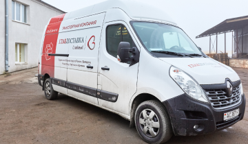

Замечания по верстке страницы glavdostavka.by

1.	Имеются расхождения с макетом. (отступы, ширина элементов, оформление шрифта)
1.1. Есть модуль для браузеров PerfectPixel. Расхождения с макетом по вертикали и горизонтали до 5 px.
2.	Необходимо избегать привязки к div в таблице стилей.
3.	Нарушены принципы ООП при построении стилей:
3.1.	Container – блок, header – его модификатор.
3.2.	Каскадность элементов внутри блока. Плохой вариант:
search-form .search-form__btn
3.3.	form--little Зачем такой модификатор если есть блок calculator? Можно использовать calculator-widget для маленького и calculator-page для страницы.
3.4.	Основные стили прописываются для блока , дополнительные для модификатора
btn-reverse btn-reverse--black
3.5.	Если есть модификации к конкретной странице в классе тега main указываем название страницы. А в блоке применяем модификатор к этой странице (п 3.3.)
3.6.	Если используешь самостоятельный блок внутри другого блока ,тогда определяешь его положение внутри блока как элемента. Например:
Блок checkbox, внутри блока package, который находится внутри form (package form__package/ checkbox package__checkbox
4.	Иконки и другие графические элементы в оформлении вставлены через картинки (засорение кода). Рекомендуется делать фоном. Плозой вариант:
<button class="search-form__btn"></button>
5.	form__label Для этого элемента логично сделать ширину 100% и изменять её модификатором
6.	
<a class="link" href="">Подробнее</a>
 Зачем оборачивать в р, класс логичнее news__ link
7.	<figure class="news__item">
                    
                    <figcaption>
                        
03.03.2020 г.

                        <h5>С 10.03 сокращаем сроки доставки по Беларуси!</h5>
                        

                            Доставка в пункты выдачи для интернет-магазинов.  
                            Доставка в сетевые магазины по Беларуси.  
                            Без предоплаты на счет.
                        

                        
<a class="link" href="">Подробнее</a>

                    </figcaption>
                </figure>
В данном случае по семантике нужно оформить как article, один блок span (дата) заголовок, p (параграф в котором другие элементы стилизуем), и его(article) обернуть в ссылку. Подробнее в данном случае будет как элемент оформления.
8.	Не используются переменные для шрифтов, цветов.
9.	Посмотри как оформляется блок социальных иконок в текущем проекте /belarus  (у контент менеджера должна быть возможность быстрой замены ссылки без риска сломать код)
10.	Модификаторы!!! btn btn—pink У тебя же блок называется contacts
